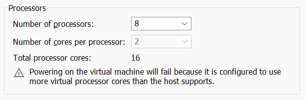
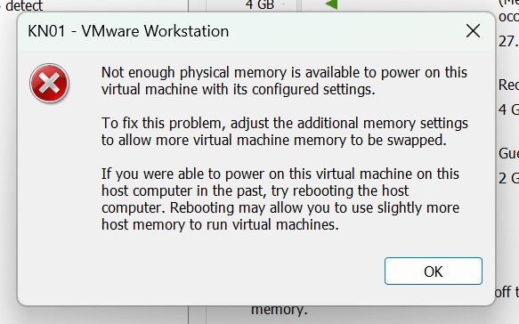

A:

Typ 1 Hypervisor (Bare-Metal Hypervisor)
	Wird direkt auf der Hardware des Hosts installiert.
	Funktioniert unabhängig von einem Betriebssystem.
	Beispiele: VMware ESXi, Microsoft Hyper-V, Xen.
	Vorteile: Höhere Performance, geringere Latenz, da keine zusätzliche Schicht zwischen Hardware und Hypervisor liegt.
	Einsatz: Oft in Rechenzentren und Produktionsumgebungen.

Typ 2 Hypervisor (Hosted Hypervisor)
	Läuft als Softwareanwendung auf einem bestehenden Betriebssystem.
	Beispiele: Oracle VirtualBox, VMware Workstation, Parallels Desktop.
	Vorteile: Einfach einzurichten und für den Einsatz auf Desktop-Computern geeignet.
	Nachteile: Performance-Einbußen durch die Abhängigkeit vom Host-Betriebssystem.

Zusammenfassung der Unterschiede:

Typ 1: Direkter Zugriff auf Hardware, besser für produktive Systeme.
Typ 2: Läuft auf einem Betriebssystem, einfacher für Test- und Entwicklungszwecke.

B:

### CPU-Test

	

Erklärung und Fazit
Warum gibt es Fehlermeldungen?
Es liegt daran, dass der Hypervisor nur die verfügbaren Ressourcen unseres Host-Systems nutzen kann. Das bestätig, dass es sich um einen Typ-2-Hypervisor handelt, der keine direkte Hardwaresteurung hat.

Kuzes Fazit
Unsere Vermutung, dass es sich um einen Hypervisor Typ 2 handelt, wurde bestätigt.