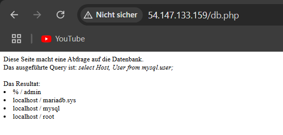
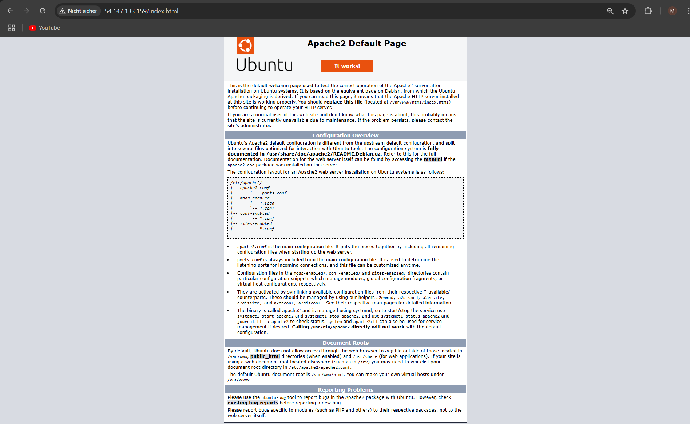
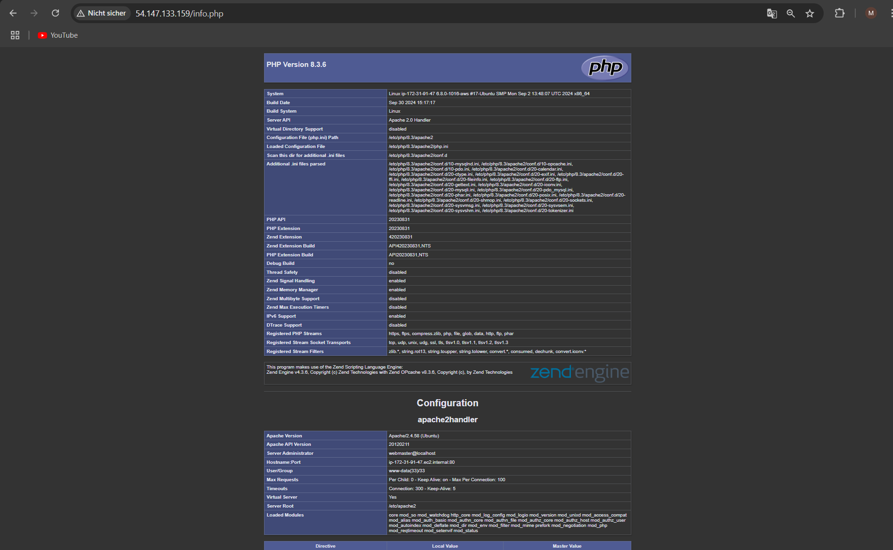
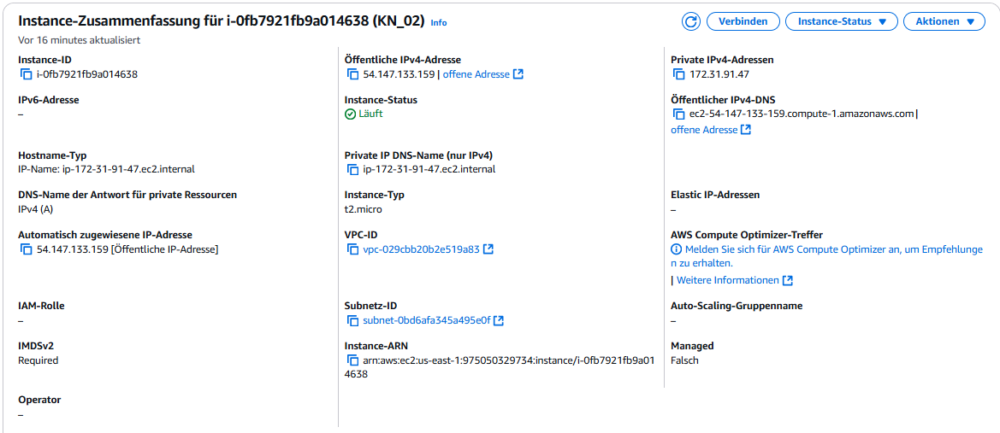
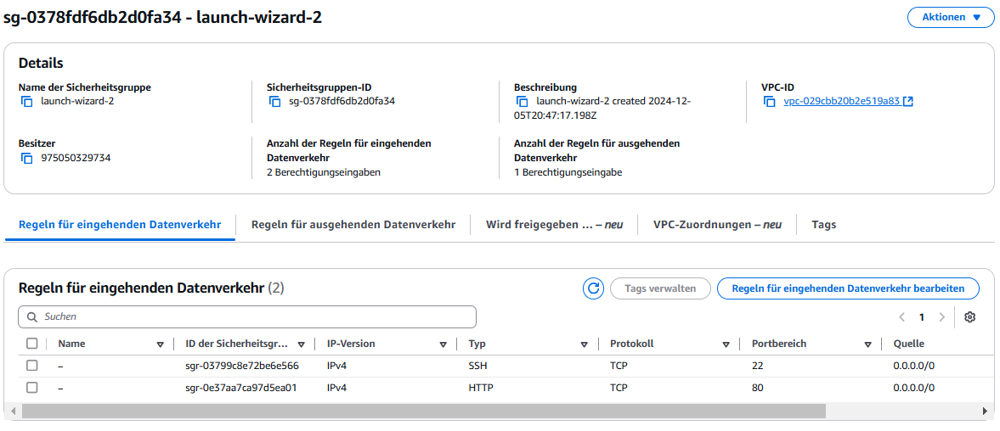
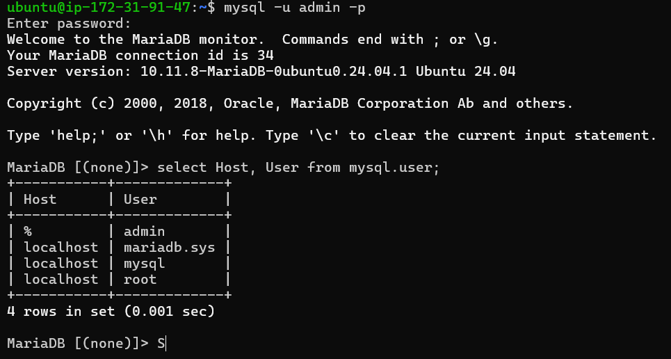

# Abgabe KN-03














## Kurze Erklärung was Ihre SQL-Abfrage (SELECT-Statement) ausliest

```
select Host, User from mysql.user;
```

Es werden der Host und der Benutzer aus der MySQL-Datenbank sowie der Tabelle User angezeigt.
