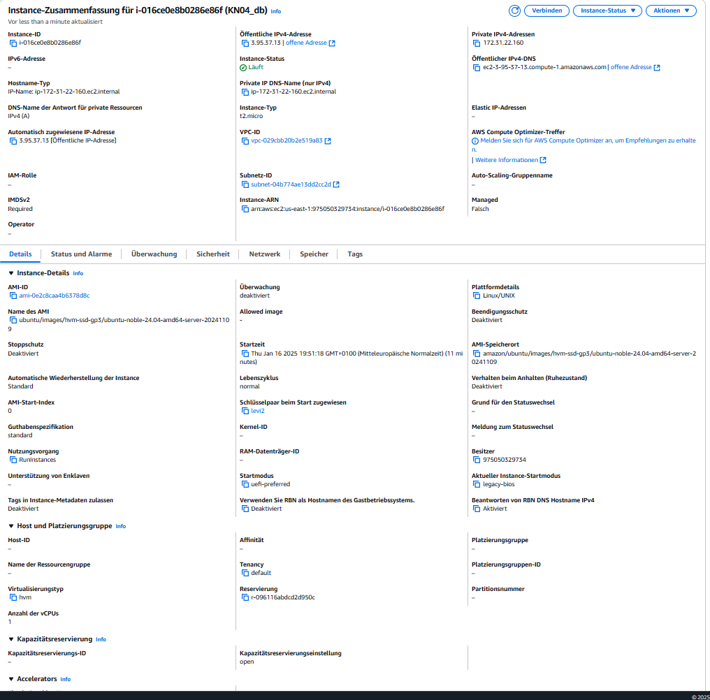
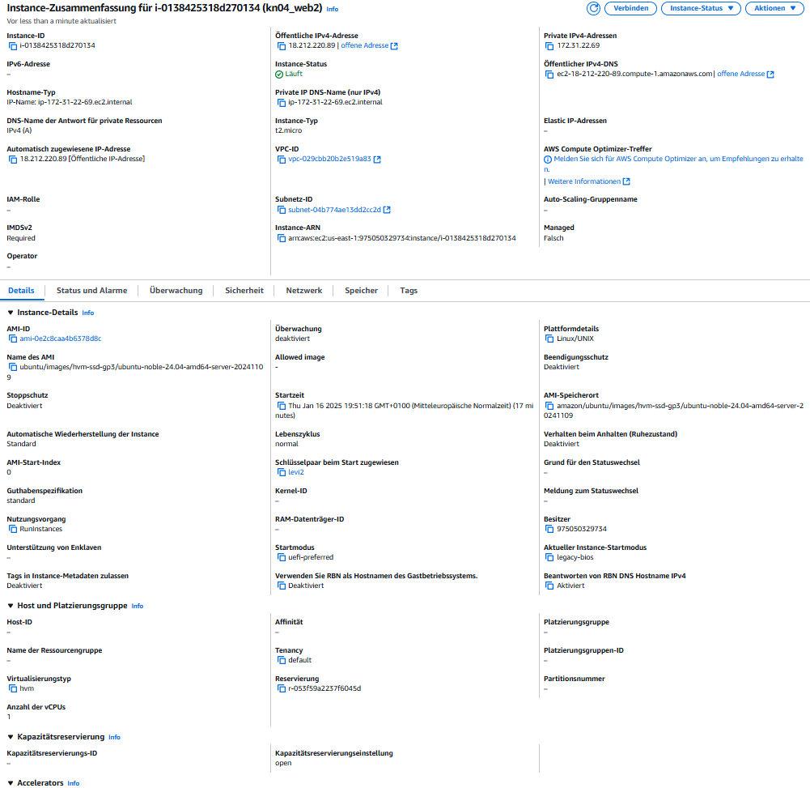
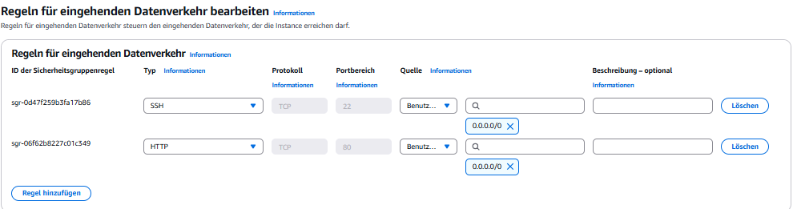
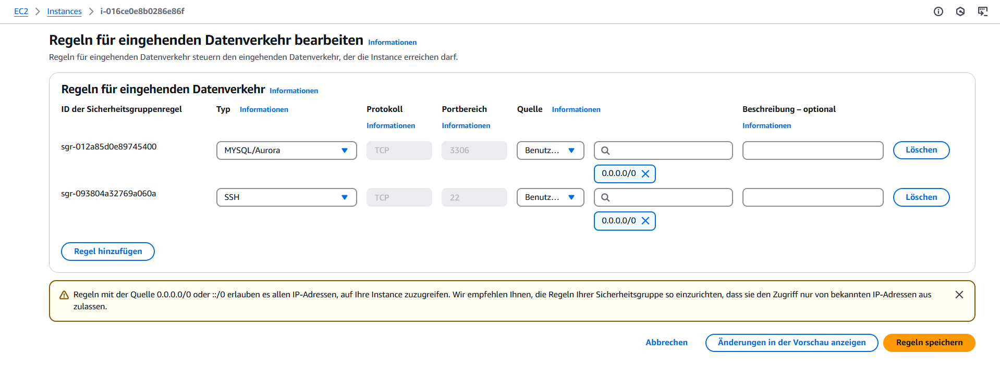
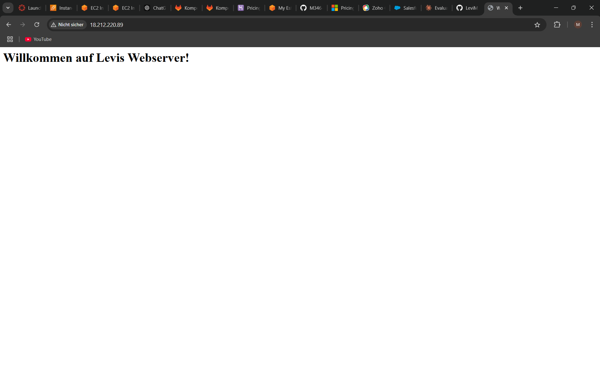
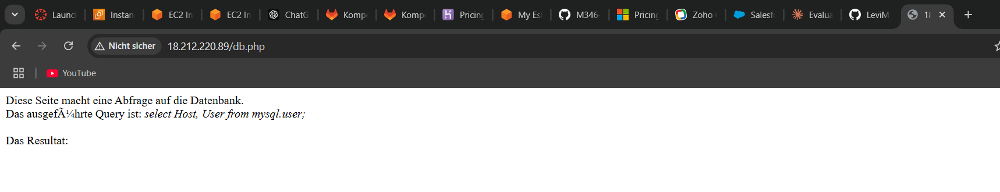
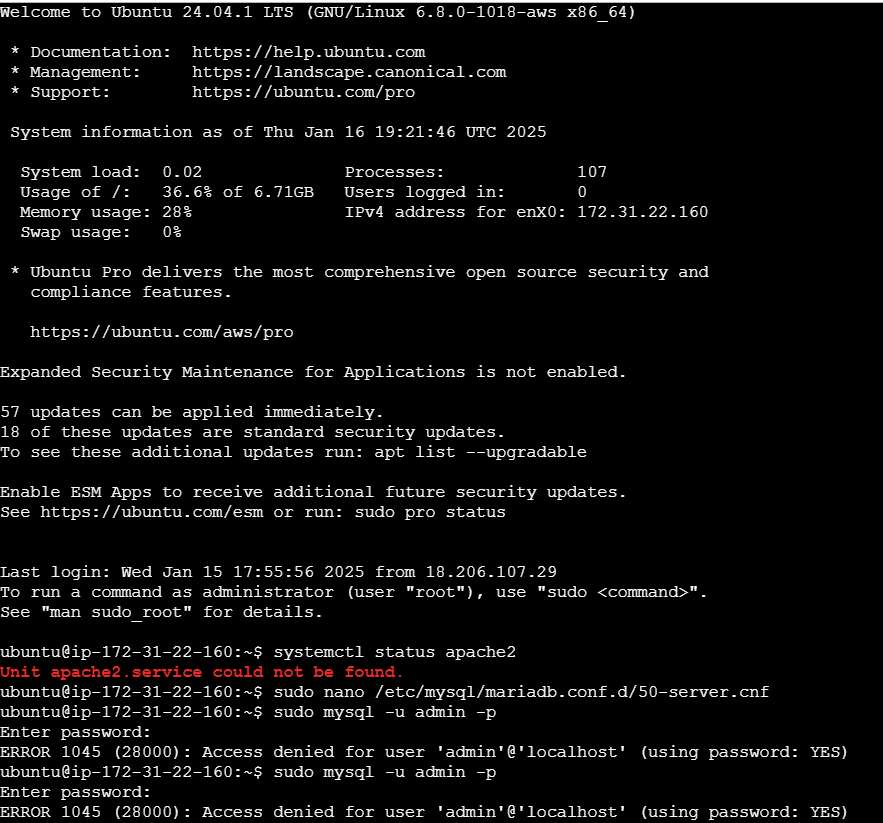
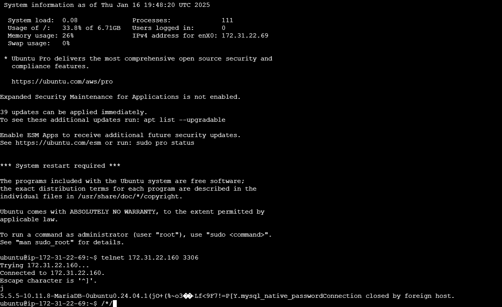

# Cloud-init: Einführung und Beispiel

## Was ist Cloud-init?
Cloud-init ist ein Werkzeug zur automatisierten Konfiguration von virtuellen Maschinen in Cloud-Umgebungen wie AWS, Azure oder OpenStack. Es erlaubt das Erstellen von Benutzern, das Installieren von Paketen und das Ausführen von Skripten.  

## Funktionen der Cloud-init-Datei
- Benutzer `ubuntu` mit SSH-Zugang erstellen.
- Begrüßungsnachricht in `/etc/motd` speichern.  
- Nginx-Webserver installieren und starten.  
- Befehle während der Initialisierung ausführen.  

## Anwendung  
1. Datei als `cloud-init-example.yaml` speichern.  
2. Als `User Data` beim Start einer VM hochladen.  
3. Konfiguration wird automatisch ausgeführt.  

 Ein Screenshot der Details der Instanz. Scrollen Sie so weit runter, dass das Feld "Key pair assigned at launch", sichtbar ist.

Screenshot mit dem ssh-Befehl und des Resultats unter Verwendung des ersten und zweiten Schlüssels.

Screenshot mit dem Auszug aus dem Cloud-Init-Log. Der Befehl den Sie aufgerufen haben um das Log darzustellen und der obere Teil des Logs sollten sichtbar sein. Sie müssen nicht das gesamte Log abgeben.

Hier sind die Daten meiner Instance für die Datenbank. Bei der erstellung habe ich mein yml-file db bei Erweiterte Details bei Benutzerdaten importiert. das gleiche bei web-Instance

Hier habe ich den den Port 80 hinzugefügt für die Webinstance. Als Typ habe ich http benutzt.

Bis zu diesem Punkt habe ich nicht verstanden warum es keine verbindung zwischen web und db gibt. Ich habe um Hilfe gefleht und Levin Wiederkehr war mein Retter. Er hat mir gesagt das ich einer db Konsole paar befehle und hat mir dann erzählt das es schon eine Verbindung gibt aber es aus irgendeinem Grund auf db.php nicht angezeigt.

