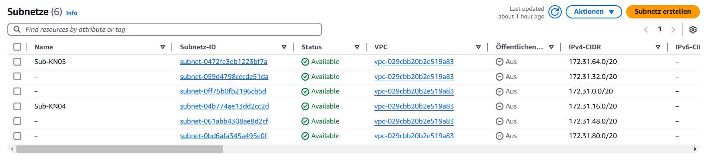
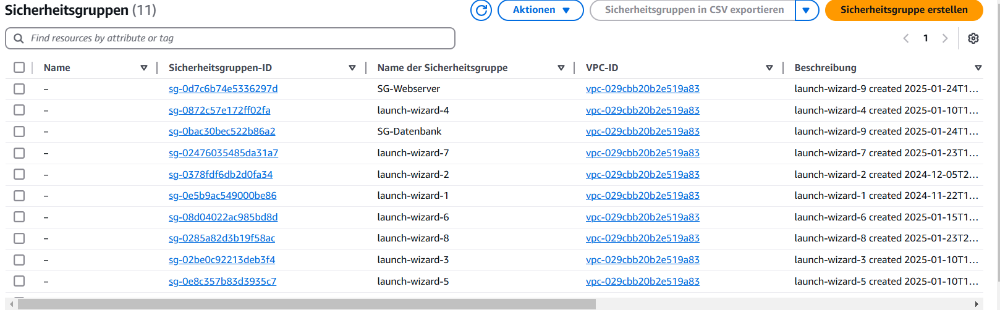
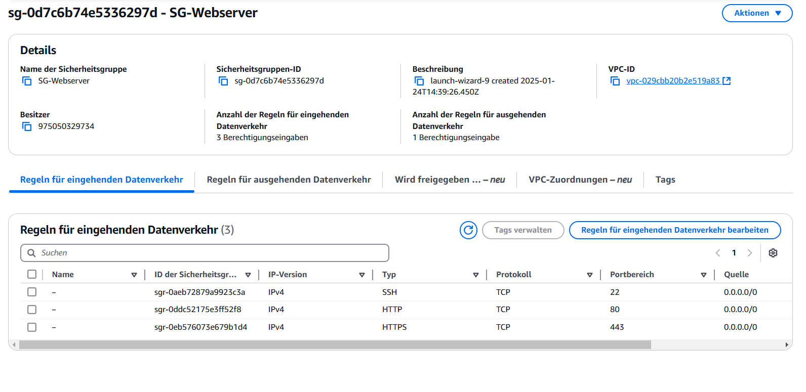
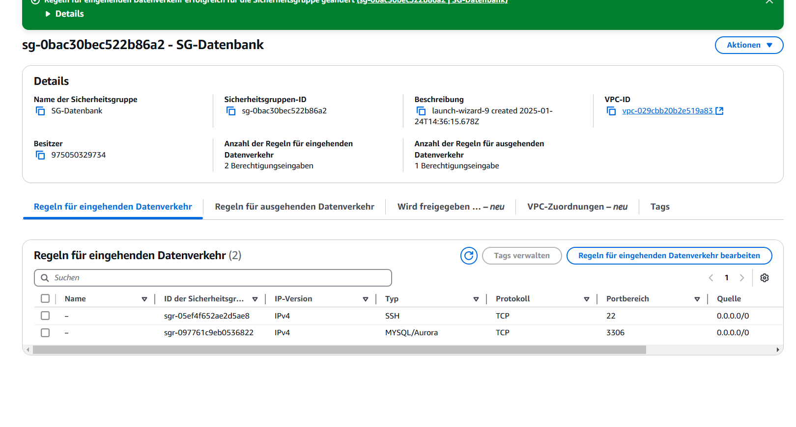
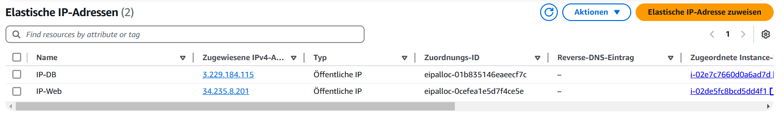

# AWS Netzwerkkomponenten

## VPC
Ein isoliertes Netzwerk in der AWS-Cloud, in dem Sie Subnetze, Sicherheitsgruppen und andere Netzwerkkomponenten erstellen können.

## Subnet
Eine Unterteilung einer VPC mit einem spezifischen IP-Bereich (CIDR). Ressourcen innerhalb eines Subnetzes können je nach Konfiguration privat oder öffentlich erreichbar sein.

## Private IP
Eine IP-Adresse, die nur innerhalb der VPC genutzt werden kann und nicht über das Internet erreichbar ist.

## Public IP
Eine IP-Adresse, die weltweit über das Internet zugänglich ist.

## Static IP
Eine fest zugewiesene IP, die auch nach einem Neustart der Ressource bestehen bleibt (z. B. Elastic IP).

Web- und DB Instances 172.31.64.10/172.31.64.20

