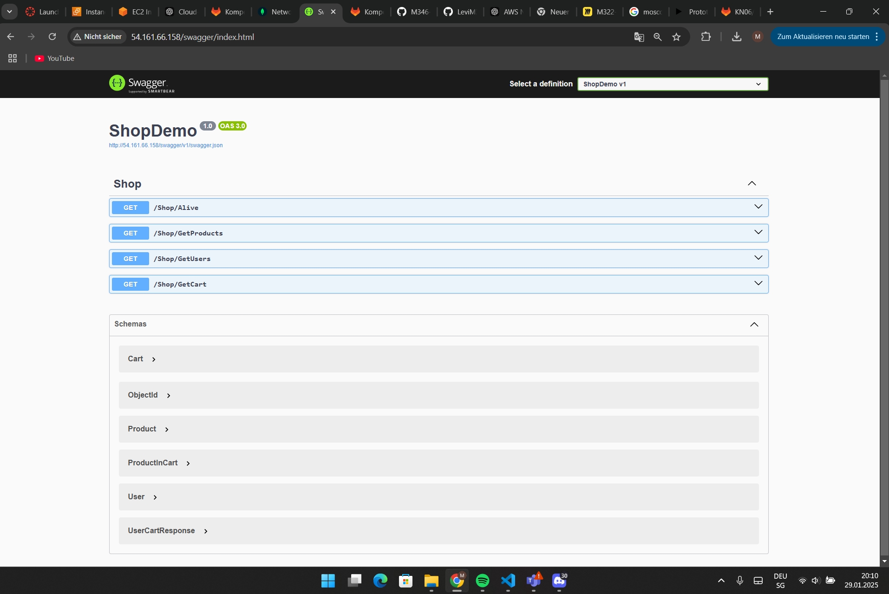
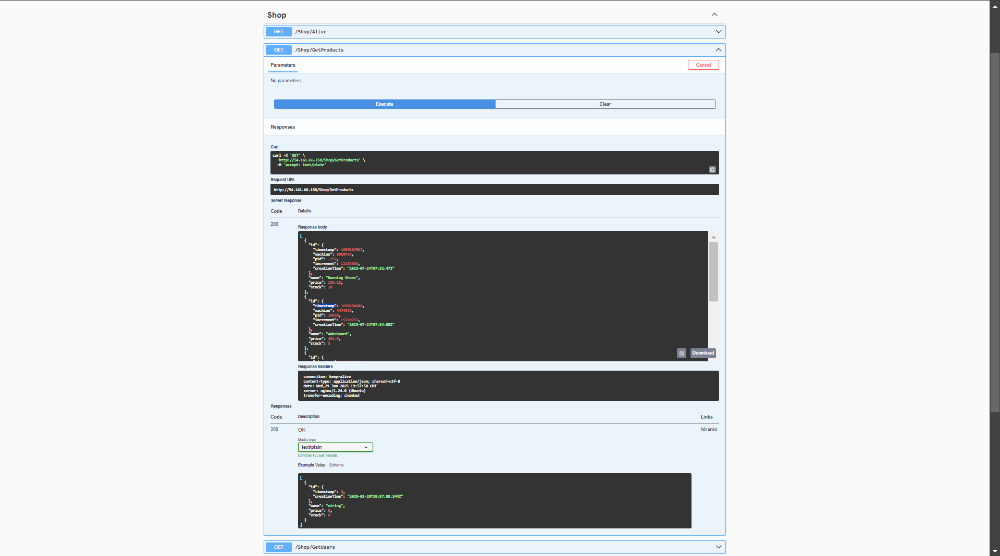
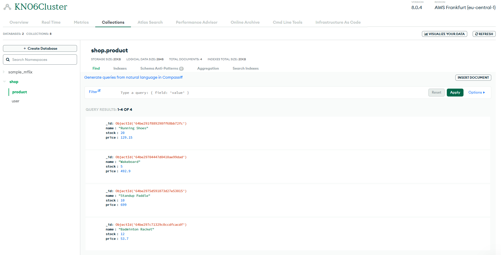

### A)
## Erklärung in eigenen Worten, was ein Reverse Proxy ist.
Ein Reverse Proxy ist ein Vermittler zwischen Client und Server. Er nimmt Anfragen entgegen,
leitet sie weiter und kann Sicherheit oder Performance verbessern.

