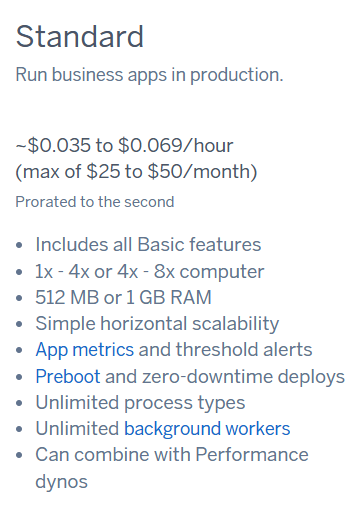
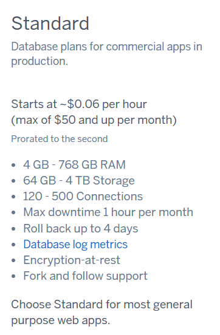
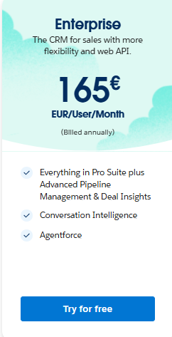
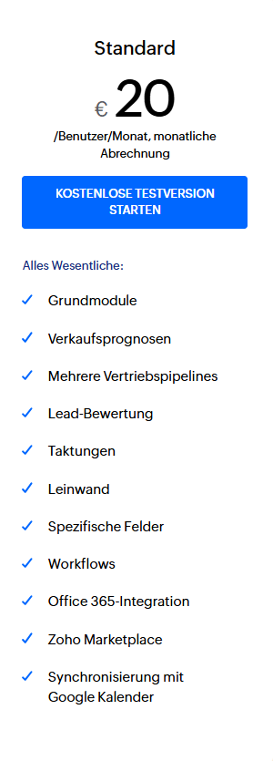

# A

## Begründung zur Auswahl der Komponenten

Die Auswahl der Komponenten habe ich so getroffen, dass die aktuelle On-Premise-Infrastruktur möglichst gut abgedeckt wird, während die Vorteile der Cloud berücksichtigt werden. Ich habe versucht, die Anforderungen der die in der Aufgabe stehen im Blick zu behalten und gleichzeitig die Kosten und Möglichkeiten der Cloud-Provider gut zu nutzen.

### 1. Leistung und Skalierung
Für beide Anbieter habe ich Instanzen gewählt, die ungefähr der bisherigen On-Premise-Umgebung entsprechen.
Das war aber schwierig, da ich nicht wirklich eine anleitung hatte was zu tun war und einfach davon ausgieng, das es richtig ist. Dabei habe ich versucht, die Leistung und den Speicherbedarf so realistisch wie möglich einzuschätzen.  

- **Azure**: Ich habe A1 v2-Instanzen genommen, da diese mit 1 Core, 2 GB RAM und ausreichendem Speicherplatz die Anforderungen gut abdecken.  
- **AWS**: Hier habe ich t4g-Instanzen gewählt, die besonders kostengünstig sind und auf ARM-Technologie basieren, was ich als effizient empfand.

Ich denke, beide Instanzen sind leistungsstark genug, um den Betrieb sicherzustellen, wobei AWS hier preislich einen Vorteil hat.

### 2. Kostenoptimierung
Ich habe die Kosten für beide Anbieter kalkuliert und dabei deutliche Unterschiede festgestellt.  

- **AWS**: Die monatlichen Kosten liegen hier bei etwa **$33,83**, was sehr günstig ist.  
- **Azure**: Die monatlichen Kosten betragen **$88,38**, was deutlich teurer ist.  

Ich habe den Eindruck, dass AWS durch die günstigeren Instanztypen und den preiswerten Backup-Dienst besser abschneidet. Daher scheint AWS in diesem Punkt die sinnvollere Wahl zu sein.

### 3. Backup-Strategie
Beide Anbieter bieten gute Backup-Lösungen an, die die bisherigen Anforderungen der Firma abdecken können. Ich habe darauf geachtet, dass tägliche, wöchentliche und monatliche Sicherungen wie gewohnt möglich sind.  

- **Azure Backup**: Ich habe die Standard Backup Policy verwendet, da sie alle notwendigen Funktionen abdeckt.  
- **AWS Backup**: Hier konnte ich günstigere Optionen finden, die ähnliche Leistungen bieten.

Für mich ist AWS hier ebenfalls ein wenig attraktiver, weil es dieselben Anforderungen zu geringeren Kosten erfüllt.

### 4. Zukunftssicherheit und Flexibilität
Beide Anbieter ermöglichen eine einfache Skalierung, falls die Firma in Zukunft mehr Leistung oder Speicherplatz benötigt. Ich habe mich bemüht, eine langfristig flexible Lösung zu finden. AWS wirkt hier wegen der günstigeren Preise ebenfalls ein bisschen vorteilhafter, aber beide Anbieter bieten grundsätzlich ähnliche Möglichkeiten.

# B
### Web

### DB

#### Begründung:
Ich habe Standart ausgewählt, weil ich schon vorher öfters einfach Standart verwendet habe.

# C

Hier macht das Sinn, weil es billig ist und alle mindestanforderungen deckt.

Ich fand es logisch, wen ich schon Standart die ganze Zeit brauche es nur Sinn macht wieder Standart zu brauchen, und es ist das Billigste und deckt viele Anvorderungen.

# D
## Kostenvergleich 

| Service Type | Anbieter | Monatliche Kosten | Jährliche Kosten | Details |
|-------------|-----------|-------------------|------------------|----------|
| IaaS | AWS | €31 | €372 | t4g.small (Web), t4g.medium (DB), AWS Backup |
| IaaS | Azure | €81 | €972 | A1 v2 VMs, Azure Backup |
| PaaS | Heroku | €69-92 | €828-1,104 | Standard Dyno + Database |
| SaaS | Zoho CRM | €600 | €7,200 | Standard Edition (30 User × €20) |
| SaaS | Enterprise CRM | €4,950 | €59,400 | Enterprise Edition (30 User × €165) |

### Zusätzliche Kosten nach Service-Typ

| Service Type | Einmalige Kosten | Laufende Zusatzkosten |
|-------------|------------------|----------------------|
| IaaS | - Migrationsprojekt - Cloud-Training - Security Setup | - Netzwerkkosten - Security-Updates - Monitoring-Tools |
| PaaS | - Code-Anpassungen - Platform-Training | - Add-ons - Skalierungskosten |
| SaaS | - Datenmigration - User-Training | - API-Integration - Customizing |

## Aufwand für die Firma

### IaaS (AWS/Azure)
- Höchster Eigenaufwand
- Migration der Applikation
- Ongoing Server-Management
- Security-Management  
- Database-Management
- Monitoring und Backup-Management
- Vorteile: Maximale Kontrolle und Flexibilität
- Team benötigt Cloud-Expertise

### PaaS (Heroku)
- Mittlerer Aufwand
- Code-Anpassungen für Heroku-Plattform
- Weniger Server-Management nötig
- Platform kümmert sich um Updates/Patches
- Team braucht Heroku-spezifisches Know-how
- Vorteile: Guter Mittelweg zwischen Kontrolle und Management-Aufwand

### SaaS (Zoho/Enterprise)
- Geringster technischer Aufwand
- Hauptaufwand: Datenmigration und User-Training
- Kein Server-Management nötig
- Keine Code-Wartung erforderlich
- Vorteile: Fokus auf Geschäftsprozesse statt Technik
- Nachteile: Weniger Flexibilität bei Customizing

## Fazit
Da der CEO technisch nicht gut ist und die bestehende Lösung älter ist, wäre eine SaaS-Lösung (Zoho CRM) die sicherste Wahl:
- Moderates Pricing im Vergleich zur Enterprise-Lösung
- Geringer technischer Overhead
- Standardisierte Prozesse
- Regelmäßige Updates  
- Gutes Preis-Leistungs-Verhältnis
- Fokus auf Geschäftsprozesse statt technischer Infrastruktur